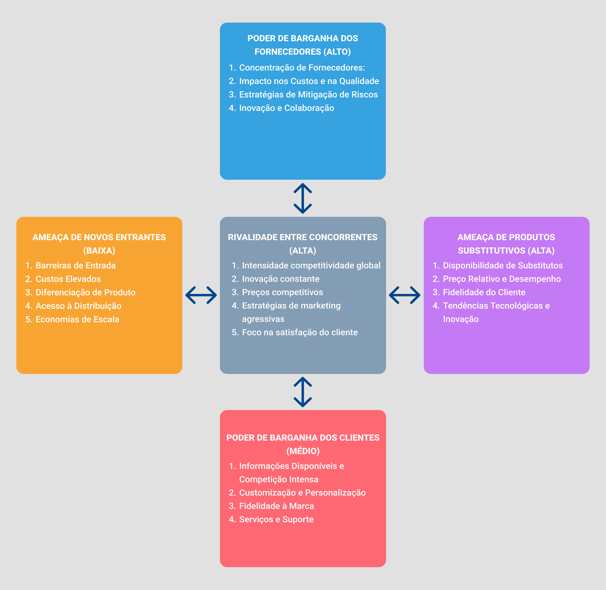
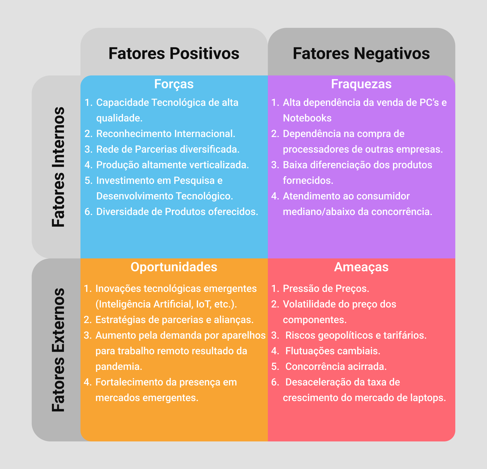
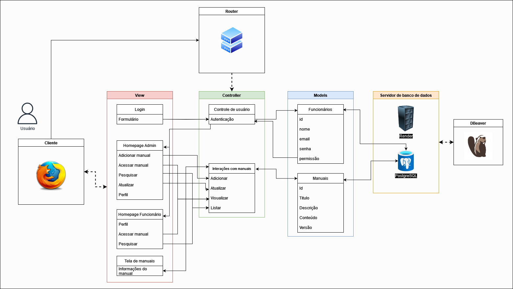
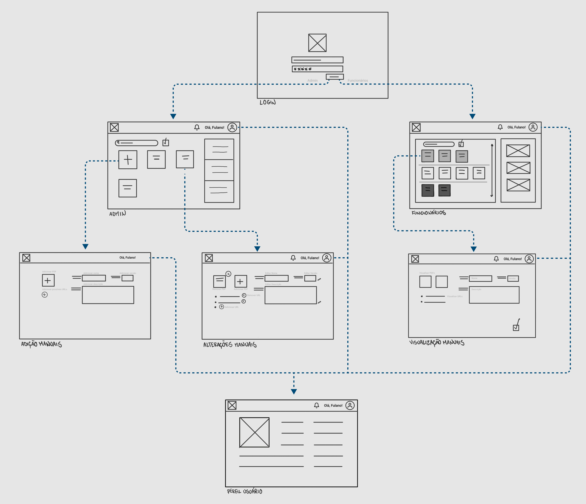

# WAD - Web Application Document - Módulo 2 - Inteli

## Nome do Grupo

#### Nomes dos integrantes do grupo

Anna Giulia Marques Riciopo 
Cibele Figueredo Leal  
Danilo Martins Merlo  
Iasmim Santos Silva de Jesus  
Jonathan Teodoro Alves  
Leonardo Casal Andriolo  
Pedro Pinheiro Rodrigues  

## Sumário

[1. Introdução](#c1)

[2. Visão Geral da Aplicação Web](#c2)

[3. Projeto Técnico da Aplicação Web](#c3)

[4. Desenvolvimento da Aplicação Web](#c4)

[5. Testes da Aplicação Web](#c5)

[6. Conclusões e trabalhos futuros](#c6)

[7. Referências](#c7)

[Anexos](#c8)

 

# 1. Introdução (sprints 1 a 5)

&nbsp;&nbsp;&nbsp;&nbsp;O presente projeto, denominado DIVE, consiste no desenvolvimento de uma aplicação web personalizada para o parceiro Dell Technologies, que visa aumentar a eficiência das linhas de montagem e diminuir o tempo de aprendizagem dos funcionários sobre alterações, melhorias, e ajustes nos processos de montagem. A solução proposta tem o intuito de facilitar a interação entre engenheiros e montadores de forma prática, segura e organizada.

&nbsp;&nbsp;&nbsp;&nbsp;A motivação do parceiro para buscar um processo mais eficiente deriva da diversidade de tipos de produtos que montam, os quais possuem manuais de montagem que descrevem minuciosamente cada etapa de montagem e a ordem que elas devem ocorrer para aumentar a eficiência do processo, com alguns produtos possuindo mais de um manual.

&nbsp;&nbsp;&nbsp;&nbsp;O principal propósito do projeto é consolidar todos os manuais de montagem em um único lugar, ao mesmo tempo em que visa aprimorar o acesso dos montadores a esses manuais, otimizar as notificações sobre atualizações e tornar todo o processo mais eficiente.

&nbsp;&nbsp;&nbsp;&nbsp;A plataforma web possuirá funções que atendem tanto os engenheiros quanto os montadores. Para os engenheiros, denominados administradores, buscamos fornecer dados úteis tempestivamente e possibilitar as ações de gerenciamento dos manuais. Do outro lado, para os montadores, denominados funcionários, buscamos criar uma plataforma intuitiva e direta, que mostre exatamente os manuais que precisam ser estudados.

&nbsp;&nbsp;&nbsp;&nbsp;Em suma, o projeto DIVE visa aprimorar a eficiência das linhas de montagem da Dell Technologies, consolidando todos os manuais de montagem em uma plataforma web personalizada. Ao oferecer acesso simplificado e notificações instantâneas sobre atualizações, o DIVE busca facilitar a interação entre engenheiros e montadores, tornando todo o processo mais eficiente e reduzindo o tempo de aprendizagem dos funcionários.

# 2. Visão Geral da Aplicação Web (sprint 1)

## 2.1. Escopo do Projeto (sprint 1)

### 2.1.1. Contexto da indústria (sprint 1)

&nbsp;&nbsp;&nbsp;&nbsp; A Dell é uma empresa multinacional de tecnologia, fundada em 1984 nos Estados Unidos. Inicialmente focada na produção de _pocket computers_ (PCs) e notebooks para consumidores comuns, a empresa expandiu suas operações para o mercado corporativo e de serviços de tecnologia da informação. A aquisição da _EMC Corporation_ em 2016 marcou uma grande mudança, dando origem à Dell Technologies, dividida em duas partes: a _Dell Client Solutions Group_, que se concentra em produtos para consumidores individuais, e a _Dell EMC Infrastructure Solutions Group_, voltada para o mercado corporativo, nacional e internacionalmente.[¹](#c7)

### 2.1.2. Modelo de 5 Forças de Porter (sprint 1)

&nbsp;&nbsp;&nbsp;&nbsp; As Cinco Forças de Porter, propostas por Michael Porter, são um modelo analítico amplamente utilizado para entender a competitividade de um setor. Elas são: ameaça de novos entrantes, poder de barganha dos compradores, poder de barganha dos fornecedores, ameaça de produtos substitutos e intensidade da rivalidade entre os concorrentes. Este modelo oferece uma estrutura concisa para avaliar a dinâmica competitiva de um mercado específico.

&nbsp;&nbsp;&nbsp;&nbsp; Ao explorar a indústria de tecnologia, particularmente o segmento de computadores e hardware, percebemos a influência marcante dessas forças. Neste contexto, examinaremos como as características distintivas desse setor influenciam a estratégia e o posicionamento competitivo da Dell, destacando a necessidade contínua de inovação e diferenciação para sustentar sua liderança.

  Figura 1 — 5 Forças de Porter 
 
 Fonte: Material produzido pelos autores (2024). 
  

#### Ameaça de novos entrantes (BAIXA):

**1. Barreiras de Entrada:** A indústria de tecnologia possui significativas barreiras de entrada, como alto investimento inicial, constante investimento em P&D e alta concorrência. A Dell Technologies já estabeleceu uma marca forte, possui economias de escala e uma ampla rede de distribuição, além de investimentos pesados em P&D e tecnologia.

**2. Custos Elevados:** Como citado anteriormente, os custos iniciais para entrar no mercado de tecnologia são substanciais. Isso inclui pesquisa e desenvolvimento, fabricação, marketing e distribuição. A Dell já tem uma base estabelecida e pode distribuir os custos ao longo de suas operações globais, tornando-a mais competitiva em termos de custos.

**3. Diferenciação de Produtos:** A necessidade de diversificação dos produtos fornecidos e o foco na inovação contínua dificultam a entrada de novos concorrentes que não possuem as mesmas capacidades de P&D e recursos. A Dell tem uma variedade de produtos e serviços, desde hardware até soluções de software e serviços de consultoria, e possui um grande foco em manter-se sempre inovando e otimizando seus objetivos. 

**4. Acesso à Distribuição:** A Dell possui uma ampla rede de distribuição global, incluindo parcerias com revendedores e canais online. Entrar nesse espaço requer a construção ou aquisição de uma rede de distribuição comparável, o que pode ser uma tarefa difícil e demorada para novos concorrentes.

**5. Economias de Escala:** A Dell Technologies já alcançou economias de escala significativas em sua produção e operações. Isso reduz os custos unitários e aumenta a eficiência, tornando difícil para novos concorrentes competirem em termos de preço.

&nbsp;&nbsp;&nbsp;&nbsp; A ameaça de entrada de novos concorrentes na indústria de tecnologia para a Dell Technologies é relativamente baixa devido às barreiras de entrada substanciais, custos elevados de entrada, diferenciação de produtos, acesso à distribuição e economias de escala. No entanto, continuar monitorando o ambiente competitivo e inovando faz-se necessário para manter sua posição de liderança no mercado.

#### Ameaça de produtos substitutos (ALTA):

**1. Disponibilidade de Substitutos:** Na indústria de tecnologia, os produtos substitutos são muito presentes. Em vez de comprar computadores desktop ou laptops da Dell, os consumidores podem optar por tablets, smartphones ou até mesmo dispositivos da concorrência, como HP, Lenovo ou Apple. Além disso, serviços de computação em nuvem podem substituir a necessidade de hardware físico.

**2. Preço Relativo e Desempenho:** A decisão de substituir um produto da Dell por um substituto muitas vezes depende do preço relativo e do desempenho. Se um substituto oferecer desempenho semelhante a um preço mais baixo, os consumidores podem optar por mudar. Além disso, se um substituto oferecer recursos adicionais ou uma experiência de usuário superior, isso pode aumentar a ameaça de substituição.

**3. Fidelidade do Cliente:** A fidelidade do cliente à marca e aos produtos da Dell pode reduzir a ameaça de substituição. Se os clientes estiverem satisfeitos com os produtos, serviços e suporte da Dell, eles podem ser menos propensos a considerar alternativas.

**4. Tendências Tecnológicas e Inovação:** As mudanças rápidas na tecnologia e a constante inovação podem aumentar a disponibilidade de produtos substitutos. Por exemplo, avanços em dispositivos móveis e serviços de computação em nuvem podem tornar essas opções mais atraentes em comparação com os produtos tradicionais da Dell.

&nbsp;&nbsp;&nbsp;&nbsp; A ameaça de produtos substitutos na indústria de tecnologia para a Dell Technologies é significativa, considerando a ampla gama de opções disponíveis para os consumidores, incluindo dispositivos móveis, serviços de nuvem e produtos concorrentes. A empresa precisa continuar inovando, oferecendo valor agregado e mantendo a satisfação do cliente para mitigar essa ameaça. Além disso, investimentos contínuos em pesquisa e desenvolvimento são essenciais para manter a relevância no mercado em constante evolução.[²](#c7)

#### Poder de Barganha dos Fornecedores (ALTA):

**1. Concentração de Fornecedores:** A Dell possui múltiplos fornecedores, mas certos segmentos do mercado podem ser monopolizados por poucas empresas. Isso pode conferir a esses fornecedores dominantes uma vantagem de negociação, especialmente se oferecerem produtos ou serviços exclusivos ou altamente especializados. Por exemplo, no setor de processadores, a Intel e a AMD exercem uma influência substancial e possuem uma posição de negociação vantajosa sobre a Dell.

**2. Impacto nos Custos e na Qualidade:** Fornecedores com poder de barganha elevado podem aumentar os preços, impor prazos desfavoráveis e restringir o acesso a componentes essenciais, impactando diretamente na lucratividade e competitividade da empresa, assim como prejudicando a qualidade final dos produtos.

**3. Estratégias de Mitigação de Riscos:** Uma das alternativas para o gerenciamento da influência dos fornecedores é o emprego de uma abordagem multifacetada: diversificação de fontes, contratos sólidos, parcerias estratégicas de longo prazo e verticalização em áreas-chave da cadeia de suprimentos.

**4. Inovação e Colaboração:** Procura não apenas reduzir os riscos ligados aos fornecedores, mas também fomentar a inovação e a colaboração com eles. Isso envolve parcerias em pesquisa e desenvolvimento, compartilhamento de práticas eficazes e criação conjunta de soluções tecnológicas avançadas.

&nbsp;&nbsp;&nbsp;&nbsp; O poder de barganha dos fornecedores representa uma força significativa na análise estratégica da Dell Technologies. Devido à natureza do setor de tecnologia, a disponibilidade e a qualidade dos componentes eletrônicos são críticas para a produção eficiente dos produtos da Dell, como laptops, desktops e servidores. Isso confere aos fornecedores um alto poder de negociação, especialmente em momentos de escassez de oferta ou flutuações nos preços das matérias-primas, impactando diretamente os custos de produção da Dell e sua capacidade de competitividade no mercado.

#### Poder de Barganha dos Clientes (MÉDIA):

**1. Informações Disponíveis e Competição Intensa:** Compradores no setor de tecnologia, incluindo empresas e consumidores finais, têm acesso a uma ampla gama de informações sobre produtos, preços, avaliações e comparativos. Isso aumenta sua capacidade de tomar decisões informadas e de comparar ofertas de diferentes empresas.

**2. Customização e Personalização:** Uma das estratégias da Dell é oferecer produtos altamente personalizáveis, como computadores e servidores sob medida. Isso dá aos compradores um maior poder de negociação, pois podem especificar exatamente o que desejam e comparar os preços com base nessas especificações.

**3. Fidelidade à Marca:** Embora a Dell tenha uma base de clientes leais, especialmente no segmento corporativo, a fidelidade à marca não elimina completamente o poder de negociação dos compradores. Eles ainda podem buscar alternativas se encontrarem ofertas mais atraentes em termos de preço, qualidade ou serviço.

**4. Serviços e Suporte:** Além do produto em si, os compradores também consideram os serviços pós-venda e o suporte oferecido pela Dell e por seus concorrentes. Isso influencia suas decisões de compra e pode afetar a negociação de preços e condições contratuais.

&nbsp;&nbsp;&nbsp;&nbsp; O poder de negociação dos compradores se refere à capacidade dos compradores de influenciar os preços, as condições de venda e a qualidade dos produtos ou serviços oferecidos pela empresa. Na indústria de tecnologia, especialmente em segmentos como hardware e software, os compradores têm um papel significativo devido à sua habilidade de comparar facilmente produtos e serviços, além da disponibilidade de informações online sobre preços e características.

#### Rivalidade entre concorrentes (ALTA):

**1. Intensidade competitividade global:** A arena competitiva da indústria de tecnologia é altamente disputada e estende-se globalmente, com várias empresas que vendem produtos semelhantes buscando conquistar mercados emergentes e estabelecidos. Essa expansão aumenta a rivalidade, pois a empresa compete não apenas com concorrentes locais, mas também com _players_ globais, como HP, Lenovo, Apple, entre várias outras.

**2. Inovação constante:** A rivalidade é alimentada pela constante busca por lançamentos mais avançados e atrativos para os consumidores. Isso inclui melhorias de desempenho, novos recursos e funcionalidades e designs inovadores.

**3. Preços competitivos:** As empresas frequentemente reduzem os preços para atrair clientes, resultando em margens de lucro apertadas e pressão constante sobre os preços.

**4. Estratégias de marketing agressivas:** Investimentos significativos são feitos em campanhas de marketing para conquistar a atenção do consumidor. Aqui há a inclusão de publicidade em diversos canais, patrocínios de eventos e parcerias estratégicas.

**5. Foco na satisfação do cliente:** Empresas investem em serviços, suporte técnico e fidelização para manter a satisfação e lealdade dos clientes.

&nbsp;&nbsp;&nbsp;&nbsp; Em suma, a análise das 5 forças de Porter oferece uma visão abrangente dos desafios e oportunidades que a Dell Technologies enfrenta em seu ambiente competitivo. Ao entender essas forças, podemos desenvolver estratégias eficazes para a criação de produtos e serviços que aumentem a competitividade da empresa.

### 2.1.3. Análise SWOT (sprint 1)

&nbsp;&nbsp;&nbsp;&nbsp; A análise SWOT é uma ferramenta estratégica fundamental para avaliar as forças, fraquezas, oportunidades e ameaças de uma empresa ou projeto. Essa análise fornece uma visão abrangente do ambiente interno e externo, permitindo identificar vantagens competitivas, áreas de melhoria e potenciais desafios de uma determinada empresa. 

&nbsp;&nbsp;&nbsp;&nbsp; Com base nessa abordagem, foi elaborada a seguinte matriz SWOT para a Dell:

  Figura 2 — Análise SWOT 
 
 Fonte: Material produzido pelos autores (2024). 
  

#### Forças

**1. Capacidade Tecnológica de alta qualidade:** A Dell é reconhecida por sua excelência técnica, especialmente no desenvolvimento e fabricação de hardware, investindo constantemente em tecnologia avançada para garantir a eficácia e eficiência de seus produtos.

**2. Reconhecimento Internacional:** A Dell possui uma marca globalmente consolidada, reconhecida pela qualidade e confiabilidade de seus produtos, com presença em mais de 180 países.

**3. Rede de Parcerias diversificada:** A Dell estabelece parcerias estratégicas com startups, instituições educacionais e empresas de software para impulsionar a inovação e ampliar sua presença no mercado.

**4. Produção altamente verticalizada:** A capacidade da Dell de produzir seus próprios componentes confere vantagem competitiva ao controlar os custos de produção e mitigar volatilidades do mercado.

**5. Investimento em Pesquisa e Desenvolvimento Tecnológico:** O alto investimento da Dell em pesquisa e desenvolvimento a mantém na vanguarda tecnológica, possibilitando o desenvolvimento de soluções que otimizam seus processos de produção.

**6. Diversidade de Produtos oferecidos:** A Dell oferece uma variedade de produtos, como PCs, notebooks, periféricos, servidores e soluções de armazenamento, atendendo a diversos segmentos de mercado.

#### Fraquezas

**1. Alta dependência da venda de PC’s e Notebooks:** A Dell tem uma dependência significativa das vendas de notebooks e PCs, o que torna sua receita suscetível a volatilidades nos preços ou na demanda desses produtos.

**2. Dependência na compra de processadores de outras empresas:** A dependência da Dell de fornecedores externos para componentes essenciais, como processadores, pode representar uma fraqueza devido ao alto poder de barganha desses fornecedores.

**3. Baixa diferenciação dos produtos fornecidos:** A concorrência acirrada no mercado tecnológico pode dificultar a retenção de clientes pela Dell devido à percepção de produtos não diferenciados em relação aos concorrentes.

**4. Atendimento ao consumidor mediano/abaixo da concorrência:** De acordo com uma pesquisa realizada pelo Laptop Mag 's 2023 Tech Support Showdown, em 2023, a DELL ficou em quarto lugar em melhores empresas de atendimento ao consumidor, obtendo uma pontuação de 80/100, ficando assim, atrás de empresas concorrentes como Apple e Lenovo, algo que pode influenciar diretamente na decisão de compra dos clientes.

#### Oportunidades

**1. Inovações tecnológicas emergentes (Inteligência Artificial, IoT, etc.):** A Dell pode aproveitar seu conhecimento em hardware e software para integrar tecnologias emergentes em seus produtos e serviços, atendendo às demandas crescentes por eficiência, automação e análise de dados em vários setores.

**2. Estratégias de parcerias e alianças:** A Dell pode explorar oportunidades estratégicas de parcerias e alianças com empresas líderes em tecnologia e serviços para expandir seu alcance global, aprimorar suas ofertas de produtos e serviços e fortalecer sua posição competitiva em um mercado cada vez mais dinâmico e interconectado.

**3. Aumento da demanda por aparelhos para trabalho remoto resultado da pandemia:** A Dell pode fortalecer sua posição competitiva através de parcerias estratégicas com empresas líderes em tecnologia, expandindo seu alcance global e aprimorando suas ofertas de produtos e serviços.

**4. Fortalecimento da presença em mercados emergentes:** A expansão da presença em mercados emergentes permite à Dell adaptar suas ofertas, expandir sua rede de distribuição e investir em estratégias de marketing para impulsionar o crescimento e aumentar sua participação de mercado nessas regiões em rápido desenvolvimento.

#### Ameaças

**1. Pressão de Preços:** A Dell enfrenta a ameaça da pressão de preços devido à concorrência acirrada no mercado de tecnologia, exigindo uma gestão cuidadosa dos custos e uma estratégia de precificação competitiva para manter sua posição.

**2. Volatilidade do preço dos componentes:** A volatilidade nos preços dos componentes tecnológicos representa uma ameaça para a Dell, afetando os custos de produção e a competitividade da empresa.

**3. Riscos geopolíticos e tarifários:** Os riscos geopolíticos, incluindo disputas comerciais e mudanças nas políticas internacionais, representam uma ameaça para a Dell devido a possíveis aumento dos custos de produção e interrupções nas cadeias de suprimentos globais.

**4. Flutuações cambiais:** As flutuações cambiais representam uma ameaça para a Dell, devido à sua presença global, impactando custos, receitas e lucratividade, exigindo estratégias de hedge eficazes.

**5. Concorrência acirrada:** A concorrência acirrada no mercado de tecnologia representa uma ameaça para a Dell, exigindo constante inovação e diferenciação para manter sua competitividade.

**6. Desaceleração da taxa de crescimento do mercado de laptops:** A desaceleração no crescimento do mercado de laptops ameaça a Dell, requerendo diversificação do portfólio e adaptação às mudanças nas preferências dos consumidores.
&nbsp;&nbsp;&nbsp;&nbsp; Por fim, essa Análise SWOT trouxe uma descrição sobre os fatores internos e externos da Dell. Assim, a análise nos auxiliou a ter um melhor entendimento da dinâmica de mercado da empresa.

### 2.1.4. Solução (sprints 1 a 5):

&nbsp;&nbsp;&nbsp;&nbsp;O treinamento dos funcionários que trabalham nas linhas de montagem da fábrica da empresa é uma questão crucial a ser abordada. Neste contexto, é proposta a implementação do DIVE (Dell Interactive Virtual Environment), um ambiente virtual personalizado desenvolvido pela Dell. O DIVE consiste em uma aplicação web projetada para facilitar a interação entre engenheiros e montadores, possibilitando a atualização e o ensino eficiente dos métodos de construção dos produtos. 

&nbsp;&nbsp;&nbsp;&nbsp;Esta solução será exclusivamente utilizada na fábrica da Dell, dentro de sua rede Wi-Fi, visando garantir a segurança dos manuais. Os engenheiros, responsáveis pela produção e atualização dos manuais, serão os administradores do DIVE. Sua função será fazer o upload dos manuais atualizados, designando-os para funcionários específicos de acordo com a necessidade identificada. 

&nbsp;&nbsp;&nbsp;&nbsp;O DIVE proporcionará uma melhoria significativa na relação entre engenheiros e montadores, de maneira prática, segura e organizada. Os administradores poderão disponibilizar os manuais especificamente para os funcionários desejados. Além disso, os funcionários serão alertados sobre as atualizações por meio de uma aba de notificação. Após a leitura dos manuais, os montadores deverão marcar o status como 'Concluído', possibilitando que o engenheiro responsável controle quem completou o treinamento. 

&nbsp;&nbsp;&nbsp;&nbsp;A medida de sucesso desta implementação será avaliada com base no aumento da produtividade geral da fábrica, na redução da taxa de erros de produção e na diminuição do tempo médio necessário para completar o treinamento de todos os funcionários. Estes parâmetros serão avaliados comparativamente, antes e depois da aplicação da solução, uma análise que será conduzida pela própria Dell. 

### 2.1.5. Proposta de Valor (sprint 1)

&nbsp;&nbsp;&nbsp;&nbsp; O Canva Proposta de Valor é uma ferramenta que se divide em duas partes, o Perfil do Cliente e a Proposta de Valor, o primeiro auxilia o usuário dela a entender as necessidades de seu consumidor, e a segunda o ajuda a desenvolver um produto ou serviço que atenda tais necessidades. 

&nbsp;&nbsp;&nbsp;&nbsp; O Perfil do Cliente se divide em três partes: nos "Ganhos" são listados os benefícios (tempo, dinheiro, contribuições ou até benefícios emocionais) que o consumidor gostaria ou seria positivamente surpreendido caso ocorressem; nas "Dores" são listadas as frustrações que o consumidor se depara atualmente, podem ser problemas, impedimentos ou até sentimentos negativos; e nas "Tarefas do Clientes" são listados as obrigações/desafios que o consumidor passa diariamente sem o auxilio do produto. 

&nbsp;&nbsp;&nbsp;&nbsp; A Proposta de Valor se divide em outras três partes. Nos "Criadores de Ganhos" estão inseridas as características do produto que garantem os "Ganhos" definidos do consumidor. Em "Analgésicos", estão os fatores do produto que resolvem ou minimizam as "Dores" dos consumidores. E, finalmente, em "Produtos e Serviços" é descrito qual é a solução e uma breve descrição dela. 

&nbsp;&nbsp;&nbsp;&nbsp; Dito isso, segue a imagem do Canva Proposta de Valor do nosso projeto.

  Figura 3 — Canva Proposta de Valor 
 
 Fonte: Material produzido pelos autores (2024). 
  

&nbsp;&nbsp;&nbsp;&nbsp; O uso desse Canvas no nosso escopo do projeto, nos auxiliou a garantir um melhor entendimento da realidade atual do nosso público-alvo, suas necessidades, dores e desejos. Assim, idealizamos um produto que seja condizente com as necessidades do nosso consumidor. 

### 2.1.6. Matriz de Riscos (sprint 1)

&nbsp;&nbsp;&nbsp;&nbsp; A Matriz de Riscos é uma ferramenta de análise de negócios utilizada para gerenciar riscos. Através de dados dispostos em uma matriz colorida com os impactos nas linhas e a probabilidade nas colunas, é possível identificar quais são os riscos que devem receber mais atenção e energia em seu gerenciamento de uma maneira mais visual. 

&nbsp;&nbsp;&nbsp;&nbsp; Sendo assim, é possível observar a aplicação da Matriz de Riscos ao projeto na imagem abaixo:

  Figura 4 — Matriz de Riscos 
 
 Fonte: Material produzido pelos autores (2024). 
 

#### Plano de ação para as ameaças:

**1. Baixa qualidade dos materiais fornecidos:** Estabelecer uma comunicação assertiva com os fornecedores dos materiais visando sempre a plena satisfação;

**2. Mal esclarecimento das dúvidas:** Validar com o professor orientador e com a turma as perguntas a serem realizadas ao parceiro; 

**3. Mal entendimento da proposta:** Formular boas perguntas que estejam sempre muito bem alinhadas com o escopo do projeto para serem apresentadas aos parceiros nas sprints de validação; 

**4. Não se adequar às personas criadas:** Revisar e refinar as personas através de testes que se destinam a quem o projeto planeja atingir; 

**5. Falta de comprometimento dos membros da equipe:** Através da metodologia SCRUM é possível eliminar esse risco por meio de uma comunicação clara e transparente, metas realistas e muito bem estabelecidas e modelamento do comportamento desejado pelos membros da equipe. 

**6. Falta de conhecimento técnico da equipe:** Implementação de aulas, curso e treinamentos em cima dos assuntos em carência, tendo em vista prevenção e diminuição de possíveis limitações de conhecimentos técnicos. Ainda é possível reter conhecimento através dos instrutores e colegas com maiores capacitações; 

**7. Divergência de ideias:** Estabelecer um ambiente seguro e de confiança, em que os componentes da equipe se sintam confortáveis para expressar as suas ideias, mas é importante saber lidar com elas e abraçar as possibilidades na medida do possível, unindo as ideias que se conectam; 

**8. Atraso nas entregas:** É importante dar atenção para uma boa gestão do tempo, sabendo gerenciar, também, as tarefas em ordem de prioridade. Além disso, evitar fugir do escopo poupa a necessidade de retrabalho. 

#### Plano de ação para aproveitar as oportunidades:

**1. Aprendizado relevante durante a elaboração do projeto:** Durante a elaboração da solução, haverá muitas trocas entre o parceiro e o time, possibilitando, assim, aprendizado para ambas partes; 

**2. Criação de network com os parceiros:** A realização do projeto abre portas de networking tanto para o parceiro quanto para o time, facilitando algumas operações; 

**3. Criação de uma solução eficiente:** Ao fim do projeto e implantação da plataforma, a solução será responsável por aumentar a produtividade dos colaboradores e capacitar de melhor forma os novos colaboradores. 

## 2.2. Personas (sprint 1)

&nbsp;&nbsp;&nbsp;&nbsp; A criação das personas exige uma análise detalhada sobre as principais características dos clientes, como: ocupação, nível de escolaridade e formação, faixa etária, objetivos, frustrações e necessidades. Assim, é elaborado um personagem fictício, ou melhor, uma representação do cliente ideal, o qual é descrito com base nos dados coletados previamente.

&nbsp;&nbsp;&nbsp;&nbsp; Dessa forma, para esse projeto foram desenvolvidas duas personas, Gabriela e Felipe, representando uma administradora e um montador, respectivamente. A seguir, está disponível a descrição precisa de ambos os personagens:

 
     Figura 5 — Persona do Administrador 
     
     Fonte: Material produzido pelos autores (2024). 

  

 
     Figura 6 — Persona do Membro 
     
     Fonte: Material produzido pelos autores (2024). 

  

&nbsp;&nbsp;&nbsp;&nbsp; Com os dois elaborados, diversos recursos essenciais da aplicação web foram definidos. A título de exemplo, foi concluído que a visualização para usuários identificados como membros deveria ser clara e direta, a fim de ocupar o menor tempo possível do dia do montador. Essa decisão foi tomada a partir da percepção sobre as necessidades desses clientes, os quais querem realizar suas tarefas em um curto espaço de tempo, para que possam ter mais tempo de lazer, por exemplo.

&nbsp;&nbsp;&nbsp;&nbsp; Por outro lado, com a elaboração das personas, foi reconhecido que os administradores pontuam como de extrema importância o acompanhamento da leitura dos manuais pelos montadores. Portanto,  a ordem de prioridade para o desenvolvimento dos recursos do projeto foi modificada, ou seja, um painel de controle com as estatísticas e os dados sobre cada manual ou funcionário vai ter preferência durante a elaboração da aplicação.

## 2.3. User Stories (sprints 1 a 5)

&nbsp;&nbsp;&nbsp;&nbsp;As _User Stories_ são, essencialmente, uma técnica utilizada no desenvolvimento de software para capturar requisitos a partir da perspectiva do usuário. Elas consistem em descrições detalhadas de interações específicas entre o usuário e o produto ou serviço em questão. Este método proporciona uma narrativa que descreve não apenas o que o usuário está tentando alcançar, mas também as ações que ele toma para atingir seus objetivos e seus sentimentos ao longo desse processo. A utilização de _User Stories_ contribui significativamente para a criação de uma compreensão abrangente dos usuários e, consequentemente, para o desenvolvimento de soluções de design que atendam de forma eficaz às suas necessidades e expectativas.

&nbsp;&nbsp;&nbsp;&nbsp;Com base nos benefícios gerados a partir das _User Stories_, foram desenvolvidas diferentes _User Stories_ para melhor compreensão das necessidades dos usuários:

     Tabela 1: User Story T001

Identificação | T001
--- | ---
Persona | Felipe, montador da Dell.
User Story | "Como um montador, desejo acessar um catálogo de manuais que forneça informações específicas sobre cada produto relacionado, para que eu possa encontrar facilmente o que estou procurando."
Critério de aceite 1 | CR01: O usuário deve visualizar, imediatamente, ao logar na plataforma, os manuais que sofreram alteração ou foram adicionados.  &nbsp;&nbsp;a. Depois de realizar o login, o montador clicou mais de uma vez para visualizar os manuais designados: &nbsp;&nbsp; - Não clicou = correto &nbsp;&nbsp; - Clicou = errado, deve ser corrigido

     Fonte: Material produzido pelos autores (2024)

     Tabela 2: User Story T002

Identificação | T002
--- | ---
Persona | Felipe, montador da Dell.
User Story | "Como um usuário, quero ver informações detalhadas de cada manual, incluindo metadados como nome, data, versão e produto alvo, para compreender melhor seu conteúdo e contexto."
Critério de aceite 1 | CR01: Ao clicar em cada manual, usuário deve ser capaz de visualizar informações Informações: Nome, data, descrição, produto alvo.  &nbsp;&nbsp; a. Montador visualiza apenas nome e data: &nbsp;&nbsp;- Não visualizou = correto &nbsp;&nbsp;- Visualizou = errado, deve ser corrigido  &nbsp;&nbsp;b. Montador vizualiza nome, data, descrição, produto alvo. &nbsp;&nbsp;&nbsp;- Visualizou = correto &nbsp;&nbsp;&nbsp;- Não visualizou= errado, deve ser corrigido

     Fonte: Material produzido pelos autores (2024)

     Tabela 3: User Story T003

Identificação | T003
--- | ---
Persona | Gabriela, engenheira da DELL.
User Story | "Como um administrador, quero ter a capacidade de adicionar manuais às listas de tarefas dos funcionários, para orientar seu desenvolvimento e treinamento."
Critério de aceite 1 | CR01: O administrador, deve conseguir, ao adicionar ou editar formulários, encaminhá-los para um grupo de funcionários para que eles recebam essa nova atualização.  &nbsp;&nbsp; a. Ao tentar encaminhar um manual, o administrador se depara apenas com a opção de escolher individualmente quem receberá os manuais atualizados: &nbsp;&nbsp;- Sim, errado deve ser corrigido. &nbsp;&nbsp;- Não, correto  &nbsp;&nbsp;b. Ao tentar encaminhar um manual, o administrador se depara apenas com a opção de escolher individualmente quem receberá os manuais atualizados &nbsp;&nbsp;&nbsp;- Sim, correto &nbsp;&nbsp;&nbsp;- Não, errado deve ser corrigido.

     Fonte: Material produzido pelos autores (2024)

     Tabela 4: User Story T004

Identificação | T004
--- | ---
Persona | Gabriela, engenheira da DELL.
User Story | "Como um administrador, desejo ter acesso a estatísticas consolidadas de leitura e visualização dos manuais, para entender o engajamento geral dos usuários e identificar áreas de foco para melhorias ou atualizações de conteúdo."
Critério de aceite 1 | CR01: Depois de realizar o login, o admin deve visualizar, imediatamente, um painel de controle dos funcionários, com estatísticas relevantes para entendimento do progresso. Quantidade de cliques: 0  &nbsp;&nbsp; a. O usuário clicou para conseguir ver o painel de controle: &nbsp;&nbsp;- Clicou: Errado, deve ser corrigido. &nbsp;&nbsp;- Não clicou: Certo.   &nbsp;&nbsp;b.  O usuário não precisou clicar para conseguir ver o painel de controle. &nbsp;&nbsp;&nbsp;-Sim: Correto &nbsp;&nbsp;&nbsp;- Não: Errado, deve ser corrigido.

     Fonte: Material produzido pelos autores (2024)

&nbsp;&nbsp;&nbsp;&nbsp; Ao analisar as _user stories_ apresentadas, torna-se evidente a importância de compreender as necessidades e expectativas dos usuários. Cada história aborda um aspecto relevante da experiência do usuário, fornecendo insights valiosos para o desenvolvimento de produtos que atendam às demandas dos usuários de maneira eficaz. As _user stories_ apresentadas destacam a necessidade de acesso fácil e rápido a informações específicas sobre os produtos, bem como a importância de funcionalidades que permitam gerenciar e monitorar o uso dos manuais. A priorização dessas histórias garante que o foco do desenvolvimento esteja na entrega de valor aos usuários, promovendo assim uma experiência mais satisfatória e relevante para todos os envolvidos.

# 3. Projeto da Aplicação Web (sprints 1 a 4)

## 3.1. Arquitetura (sprints 1)

&nbsp;&nbsp;&nbsp;&nbsp;O Model-View-Controller (MVC) é um padrão de arquitetura utilizado no desenvolvimento de software, especialmente em aplicações web. Ele organiza a estrutura de um aplicativo em três componentes principais: o _model_, o _view_ e o _controller_. Essa separação de responsabilidades permite uma arquitetura mais modular e escalável, facilitando o desenvolvimento, a manutenção e a evolução do código.[³](#c7)

&nbsp;&nbsp;&nbsp;&nbsp; O componente _model_ tem como responsabilidade interagir com os dados por meio de suas funções, lógica e regra de negócio estabelecidas. O componente _view_ é responsável por apresentar os dados ao usuário final, ele também interage com o _model_ por meio do _controller_ para obter os dados necessários. Por fim, o componente _controller_ atua como um intermediário entre o _model_ e a _view_, ele recebe as solicitações do usuário, as processa e interage com o _model_ conforme o necessário, definindo quais informações serão enviadas para o componente _view_.

 
     Figura 7 — Arquitetura MVC 
    
     Fonte: Material produzido pelos autores (2024). 

 

&nbsp;&nbsp;&nbsp;&nbsp;No projeto em questão, será adotada a arquitetura MVC (Model-View-Controller), na qual o ``Sails.js`` será utilizado como framework _back-end_ . ``Sails.js`` é um framework MVC baseado em ``Node.js`` que facilita a construção de aplicativos web e APIs, seguindo o padrão de desenvolvimento MVC. No contexto do projeto, o ``Sails.js`` será responsável por gerenciar as camadas de _model_, _controller_ e roteamento.

&nbsp;&nbsp;&nbsp;&nbsp;No lado do cliente, as tecnologias HTML, CSS e JavaScript serão empregadas para a construção da interface do usuário (_view_). O JavaScript, tanto no cliente quanto no servidor, será utilizado para a lógica de controle (_controller_).

&nbsp;&nbsp;&nbsp;&nbsp;Além disso, o ``Sails.js`` oferece a capacidade de renderização de páginas web. No projeto, a função de renderização será utilizada para renderizar páginas HTML dinâmicas com dados provenientes do servidor. Isso permitirá a criação de páginas web dinâmicas que respondem às interações dos usuários.

&nbsp;&nbsp;&nbsp;&nbsp;No que diz respeito ao banco de dados, o PostgreSQL será utilizado para armazenar e gerenciar os dados do aplicativo. A ferramenta DBeaver será empregada para a administração do banco de dados, proporcionando uma interface amigável para consulta, visualização e manipulação dos dados armazenados.

&nbsp;&nbsp;&nbsp;&nbsp; Em resumo, o MVC é uma abordagem eficaz para projetar e desenvolver aplicativos web, promovendo a organização, a flexibilidade e a manutenção eficiente do código. Ao adotar o padrão MVC, os desenvolvedores podem criar aplicativos mais robustos e fáceis de manter.

## 3.2. Wireframes (sprint 1)
&nbsp;&nbsp;&nbsp;&nbsp; Um wireframe é uma representação visual de uma página da web ou de um aplicativo, que mostra a estrutura básica e o layout dos elementos sem detalhes de design. Esta ferramenta é fundamental no processo criativo, permitindo uma visualização clara da organização e da funcionalidade de uma interface antes do desenvolvimento completo. 

  Figura 8 — Wireframe DIVE 

Fonte: Material produzido pelos autores (2024). 

&nbsp;&nbsp;&nbsp;&nbsp; O _wireframe_ é desenvolvido com base nas _user stories_, que refletem as necessidades dos usuários. O fluxo foi elaborado com base nas _user stories_ mencionadas na seção 2.3. O processo tem início na página de _login_, onde o usuário insere suas credenciais. Após isso, ele é direcionado para sua respectiva página, que pode ser a página de funcionário, caso seja um montador, ou a de administrador, caso seja um gestor ou engenheiro.

&nbsp;&nbsp;&nbsp;&nbsp; Na página de funcionários, o usuário terá acesso a uma lista de manuais, organizada nas categorias "Para fazer", "Feito" e "Outros manuais". Essa divisão atende à _user story_ T001, que descreve a necessidade da persona de acessar os manuais facilmente. A organização em categorias proporciona essa facilidade de acesso. Além disso, ao lado direito da lista de manuais, será introduzida uma tabela de tendências.

&nbsp;&nbsp;&nbsp;&nbsp; Ao clicar em um dos manuais, o usuário tem a oportunidade de acessar seu conteúdo completo, incluindo informações como nome, data, versão e produto alvo. Isso permite que ele veja as informações detalhadas de cada manual, possibilitando uma melhor compreensão do contexto e conteúdo, conforme descrito na _user story_ T002.

&nbsp;&nbsp;&nbsp;&nbsp; Para o administrador, o processo difere. Após efetuar o login, o administrador é direcionado a uma página que exibe uma lista de manuais, juntamente com um painel de controle (dashboard). Esse painel resume as estatísticas de leitura e visualização dos manuais, atendendo às necessidades descritas na _user story_ T003. Essas informações permitem que o administrador compreenda o engajamento geral dos usuários e identifique áreas de foco para melhorias ou atualizações de conteúdo, atendendo a vontade do usuário administrador desenvolvido.

&nbsp;&nbsp;&nbsp;&nbsp; Além disso, na lista de manuais, o administrador tem a possibilidade de realizar alterações ao clicar em um manual existente, bem como adicionar novos manuais utilizando o botão de adição. Adicionalmente, o administrador pode atribuir diferentes manuais a usuários específicos. Esse procedimento atende à necessidade descrita na _user story_ T004, permitindo o gerenciamento eficiente do desenvolvimento e treinamento.

&nbsp;&nbsp;&nbsp;&nbsp;A elaboração dos wireframes, baseada nas histórias de usuário e no fluxo de interação, permitiu o desenvolvimento de interfaces distintas para os funcionários e administradores. Esses wireframes fornecem uma representação visual clara da estrutura e do layout das páginas, garantindo que as necessidades específicas de cada tipo de usuário sejam atendidas de forma eficiente.

## 3.3. Guia de estilos (sprints 2 e 3)

*Descreva aqui orientações gerais para o leitor sobre como utilizar os componentes do guia de estilos de sua solução*

### 3.3.1 Cores

*Apresente aqui a paleta de cores, com seus códigos de aplicação e suas respectivas funções*

### 3.3.2 Tipografia

*Apresente aqui a tipografia da solução, com famílias de fontes e suas respectivas funções*

### 3.3.3 Iconografia e imagens 

*(esta subseção é opcional, caso não existam ícones e imagens, apague esta subseção)*

*posicione aqui imagens e textos contendo exemplos padronizados de ícones e imagens, com seus respectivos atributos de aplicação, utilizadas na solução*

## 3.4 Protótipo de alta fidelidade (sprints 2 e 3)

*posicione aqui algumas imagens demonstrativas de seu protótipo de alta fidelidade e o link para acesso ao protótipo completo (mantenha o link sempre público para visualização)*

## 3.5. Modelagem do banco de dados (sprints 2 e 3)

### 3.5.1. Modelo relacional (sprints 2)

*posicione aqui os diagramas de modelos relacionais do seu banco de dados, apresentando todos os esquemas de tabelas e suas relações. Utilize texto para complementar suas explicações, se necessário* 

### 3.5.2. Consultas SQL e lógica proposicional (sprint 3)

*posicione aqui uma lista de consultas SQL realizadas pelo back-end da aplicação web com sua respectiva lógica proposicional, descrita conforme template oferecido pelos professores de Matemática*

## 3.6. WebAPI e endpoints (sprint 3)

*Utilize um link para outra página de documentação contendo a descrição completa de cada endpoint. Ou descreva aqui cada endpoint criado para seu sistema.* 

*Cada endpoint deve conter endereço, método (GET, POST, PUT, PATCH, DELETE), header, body e formatos de response*

# 4. Desenvolvimento da Aplicação Web

## 4.1. Primeira versão da aplicação web (sprint 2)

*Descreva e ilustre aqui o desenvolvimento da sua primeira versão do sistema web, explicando brevemente o que foi entregue em termos de código e sistema. Utilize prints de tela para ilustrar. Indique as eventuais dificuldades e próximos passos.*

## 4.2. Segunda versão da aplicação web (sprint 3)

*Descreva e ilustre aqui o desenvolvimento da sua segunda versão do sistema web, explicando brevemente o que foi entregue em termos de código e sistema. Utilize prints de tela para ilustrar. Indique as eventuais dificuldades e próximos passos.*

## 4.3. Terceira versão da aplicação web (sprint 4)

*Descreva e ilustre aqui o desenvolvimento da sua terceira versão do sistema web, explicando brevemente o que foi entregue em termos de código e sistema. Utilize prints de tela para ilustrar. Indique as eventuais dificuldades e próximos passos.*

## 4.4. Versão final da aplicação web (sprint 5)

*Descreva e ilustre aqui o desenvolvimento da última versão do sistema web, explicando brevemente o que foi entregue em termos de código e sistema. Utilize prints de tela para ilustrar. Indique as eventuais dificuldades e próximos passos.*

# 5. Testes

## 5.1. Relatório de testes automatizados (sprint 4)

*Liste e descreva os testes automatizados planejados para sua solução. Posicione aqui também o relatório de testes (através de link ou transcrito para estrutura markdown)*

## 5.2. Testes de usabilidade (sprint 5)

### 5.2.1 Registros de testes e melhorias

*Posicione aqui as tabelas com enunciados de tarefas, etapas e resultados de testes de usabilidade. Ou utilize um link para seu relatório de testes (mantenha o link sempre público para visualização)*

# 6. Conclusões e trabalhos futuros (sprint 5)

*Escreva de que formas a solução da aplicação web atingiu os objetivos descritos na seção 2 deste documento. Indique pontos fortes e pontos a melhorar de maneira geral.*

*Relacione os pontos de melhorias evidenciados nos testes com planos de ações para serem implementadas. O grupo não precisa implementá-las, pode deixar registrado aqui o plano para ações futuras*

*Relacione também quaisquer outras ideias que o grupo tenha para melhorias futuras*

# 7. Referências (sprints 1 a 5)

_Incluir as principais referências de seu projeto, para que seu parceiro possa consultar caso ele se interessar em aprofundar. Um exemplo de referência de livro e de site:_ 

&nbsp;&nbsp;&nbsp;&nbsp;Abaixo, estão contidas as referências utilizadas para embasar todo o projeto, visando entender todo o cenário, não só do cliente, como do mercado ao qual o projeto está inserida.  

LUCK, Heloisa. Liderança em gestão escolar. 4. ed. Petrópolis: Vozes, 2010.  
SOBRENOME, Nome. Título do livro: subtítulo do livro. Edição. Cidade de publicação: Nome da editora, Ano de publicação.  

INTELI. Adalove. Disponível em: https://adalove.inteli.edu.br/feed. Acesso em: 1 out. 2023  
SOBRENOME, Nome. Título do site. Disponível em: link do site. Acesso em: Dia Mês Ano

¹ Dell. Canaltech. Disponível em: <https://canaltech.com.br/empresa/dell/>. Acesso em: 23 abr. 2024   

² GARGIONI, Antônio. Estratégia da Dell. COMPANY, 2023. Disponível em: <https://v4company.com/blog/cases-de-marketing/estrategia-da-dell>. Acesso em: 16 de abr. de 2024.  

³ O QUE é padrão MVC? Entenda arquitetura de softwares!. [S. l.], 17 jul. 2020. Disponível em: <https://blog.lewagon.com/pt-br/skills/o-que-e-padrao-mvc/>. Acesso em: 26 abr. 2024. 

¹ ² ³ ⁴ ⁵ ⁶ ⁷ ⁸ ⁹

# Anexos

*Inclua aqui quaisquer complementos para seu projeto, como diagramas, imagens, tabelas etc. Organize em sub-tópicos utilizando headings menores (use ## ou ### para isso)*
